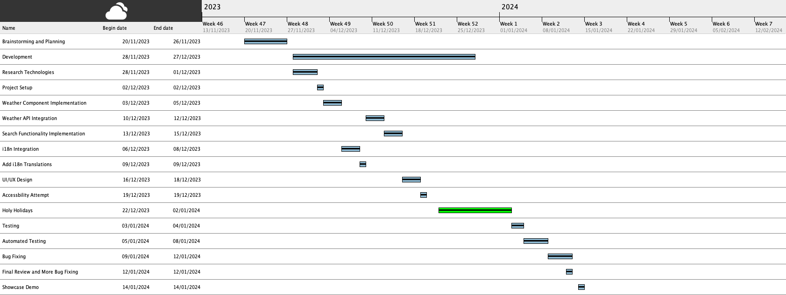

# Aplicatie Meteo (Weather App) #

#### a.k.a: Better than Busu

## Specificatii: ##

Aplicația Meteo React urmează o arhitectură bazată pe componente, utilizând diverse tehnologii și biblioteci pentru a crea o interfață de utilizator dinamică și interactivă. Specificațiile cheie includ:

**Internaționalizare:** Aplicația suportă capabilități multilingve prin integrarea bibliotecii i18next, permițând utilizatorilor să treacă de la limba engleză la limba română.

**Ceas în timp real:** Aplicația afișează un ceas în timp real folosind biblioteca react-live-clock, oferind utilizatorilor informații actualizate despre timp.

**Informații despre vreme:** Datele meteorologice sunt preluate de la API OpenWeatherMap folosind Axios. Aplicația actualizează în mod dinamic interfața cu utilizatorul pe baza informațiilor meteo recuperate, inclusiv temperatura, numele orașului și condițiile meteorologice.

**Funcționalitate de căutare:** Utilizatorii pot introduce numele unui oraș în bara de căutare, declanșând un apel la API OpenWeatherMap pentru a prelua informații meteo pentru locația specificată.

**Comutator de limbă:** Aplicația dispune de un comutator de limbă care le permite utilizatorilor să comute între traducerile în engleză și română.

## Proiectare: ##

Proiectul demonstrează o colaborare eficientă, deoarece implică doi colaboratori, Liviu Padurariu și Mariana Georges. Dezvoltarea aplicației urmează un flux de lucru structurat, începând cu brainstorming-ul și planificarea, urmate de implementarea funcțiilor cheie. Componentele proiectului includ:

**Componenta App:** Componenta principală care orchestrează întreaga aplicație, responsabilă pentru redarea informațiilor meteo, a ceasului în timp real, a comutatorului de limbă și a detaliilor de prognoză.

**Componenta Weather:** O componentă modulară și reutilizabilă axată pe afișarea informațiilor legate de vreme, utilizând API OpenWeatherMap și pictograme meteo animate.

**Integrare lingvistică:** Integrarea bibliotecii i18n pentru a facilita traducerile de limbă, creând o experiență de utilizare mai cuprinzătoare.

**Integrare API:** Utilizarea Axios pentru a interacționa cu API OpenWeatherMap, preluând și afișând date meteo în timp real pe baza datelor introduse de utilizator.

**Design vizual:** Aplicația încorporează elemente de design vizual, cum ar fi pictogramele meteo dinamice, oferind o interfață atractivă și ușor de utilizat.

## Planificare Gantt: ##

## Produse auxiliare: ##

**Biblioteca i18n:** Facilitează internaționalizarea prin furnizarea de funcționalități de traducere și comutare a limbilor în cadrul aplicației.

**Biblioteca React-Animated-Weather:** Îmbunătățește interfața cu utilizatorul prin încorporarea de pictograme meteo animate, ceea ce face ca informațiile meteo să fie atractive din punct de vedere vizual și ușor de înțeles.

**Biblioteca Axios:** Permite aplicației să facă cereri HTTP asincrone către API OpenWeatherMap, recuperând date meteorologice pentru locațiile specificate.

**Biblioteca React-Live-Clock:** Oferă o componentă de ceas în timp real care actualizează dinamic ora afișată la fiecare secundă, contribuind la o experiență mai interactivă a utilizatorului.

## Dosar de testare: ##

##  [- Plan testare](./Plan_Testare.md) 
##  [- Cazuri testare](./Cazuri_Testare.md)
##  [- Raport testare](./Raport_Testare.md)
##  [- Testare Automată](./Testare_Automata.md)
