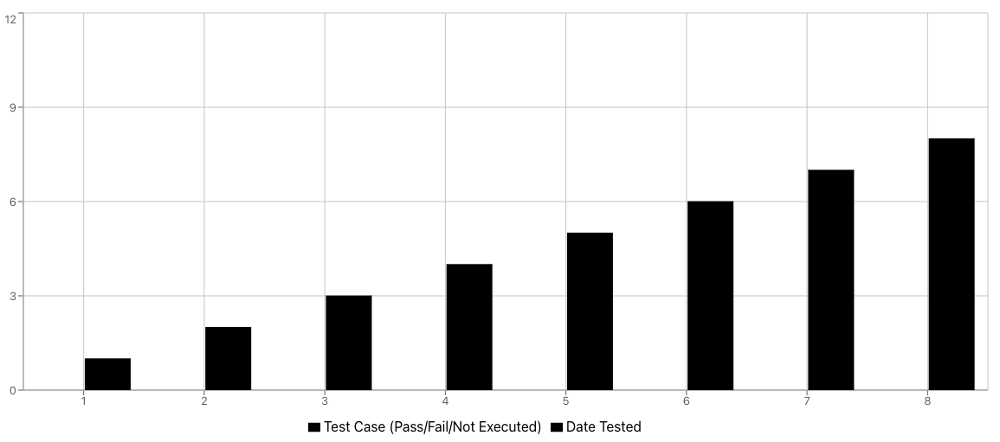

| Number | Test Case ID | Test Case Description                          | Created By      | Reviewed By     | Version | Tester's Name   | Date Tested | Test Case (Pass/Fail/Not Executed) |
| ------ | ------------ | ---------------------------------------------- | --------------- | --------------- | ------- | --------------- | ----------- | ---------------------------------- |
| 1      | WA_001       | Verify Weather Information Retrieval           | Mariana Georges | Liviu Padurariu | 1.0     | Mariana Georges | 01.01.2024  | Pass                               |
| 2      | WA_002       | Verify Language Switcher Functionality         | Mariana Georges | Liviu Padurariu | 1.0     | Mariana Georges | 02.01.2024  | Pass                               |
| 3      | WA_003       | Verify Search Functionality with Invalid Input | Liviu Padurariu | Mariana Georges | 1.0     | Liviu Padurariu | 03.01.2024  | Pass                               |
| 4      | WA_005       | Verify Search Functionality with Valid Input   | Liviu Padurariu | Mariana Georges | 1.0     | Liviu Padurariu | 04.01.2024  | Pass                               |
| 5      | WA_007       | Verify Display of Humidity Percentage          | Liviu Padurariu | Mariana Georges | 1.0     | Liviu Padurariu | 05.01.2024  | Pass                               |
| 6      | WA_008       | Verify Visibility Information Displayed        | Mariana Georges | Liviu Padurariu | 1.0     | Mariana Georges | 06.01.2024  | Pass                               |
| 7      | WA_009       | Verify Wind Speed Information Displayed        | Liviu Padurariu | Mariana Georges | 1.0     | Liviu Padurariu | 07.01.2024  | Pass                               |
| 8      | WA_010       | Verify App Responsiveness on Mobile Devices    | Mariana Georges | Liviu Padurariu | 1.0     | Mariana Georges | 08.01.2024  | Pass                               |

